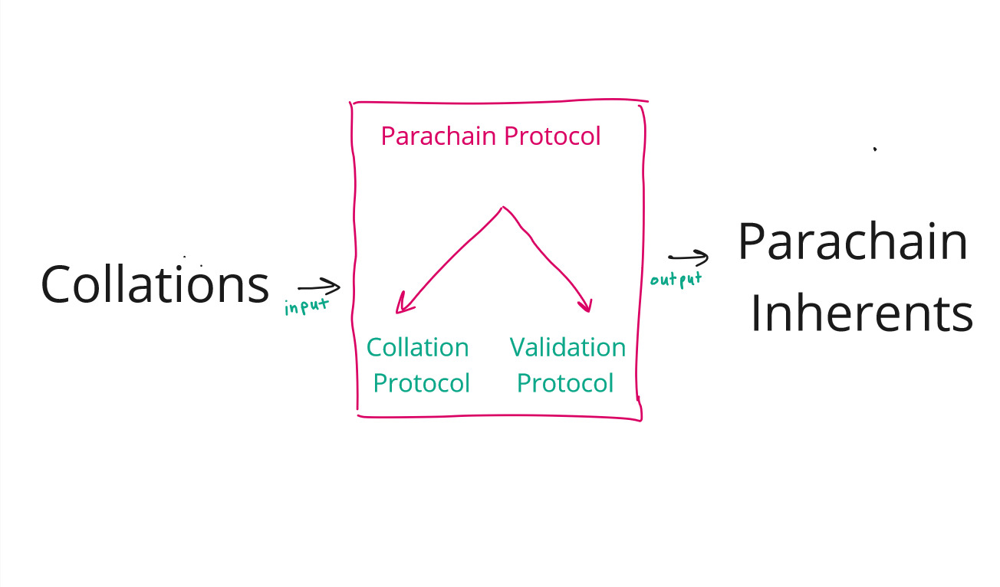
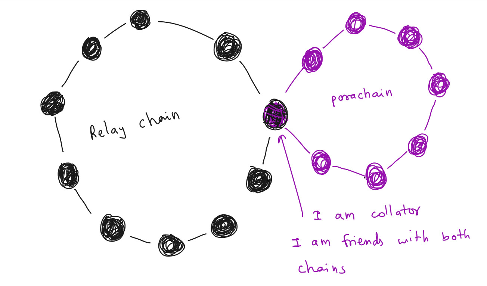

# Introduction

## Why do we even have Parachains?
- Scalability

PoS scales much better compared to PoW. Since we are not spending efforts in mining, block time and agreement could happen much faster.
However, consensus on a PoS chain requires full agreement of 2/3+ of the validator set for everything that occurs at Layer 1: all logic which is carried out as part of the blockchain's state machine. This means that everybody still needs to check everything. Furthermore, validators may have different views of the system based on the information that they receive over an asynchronous network, making agreement on the latest state more difficult.

Parachains are an example of a **sharded** protocol. Rather than requiring every participant to check every transaction, we require each participant to check some subset of transactions.

- Specialization

Being able to specialize on a problem gives the creator and users more leverage


## Why do we care? What are we trying to do?
The Primary purpose of polkadot is to provide security to parachains.
By providing security to parachains we mean
- validating
- authoring and
- finalizing
parachain blocks.

To do these task we need parachain protocol. It describes how relay chain nodes will talk to parachain nodes and include parachain blocks into relay chain.

## How do I know if a parachain block is authored?
Relay chain blocks have this information that we call `inherents`. For example we do store timeslot and babe slot as inherents in relay chain blocks.

One such inherent is `parachn0`, which is for parachain inherent data. It is through this parachain inherent data that we are going to tell which parachain blocks are authored.

https://github.com/ChainSafe/gossamer/blob/b1ecbf3c51ecd0dc0765300c13f4361334f1e04f/lib/babe/inherents/parachain_inherents.go#L452-L462

```go
// ParachainInherentData is parachains inherent-data passed into the runtime by a block author.
type ParachainInherentData struct {
	// Signed bitfields by validators about availability.
	Bitfields []uncheckedSignedAvailabilityBitfield `scale:"1"`
	// Backed candidates for inclusion in the block.
	BackedCandidates []backedCandidate `scale:"2"`
	// Sets of dispute votes for inclusion,
	Disputes multiDisputeStatementSet `scale:"3"`
	// The parent block header. Used for checking state proofs.
	ParentHeader types.Header `scale:"4"`
}
```

## What is Parachain Protocol
As a highly simplistic view, you can think of parachain protocol as a system that takes parachain blocks from parachain nodes and gives parachain inherents to be put in relay chain.



Where is Parachain Protocol running? Relay Chain Nodes.

So, how are these relay chain nodes running parachain protocol get parachain blocks from parachain nodes? Using some special nodes which are part of both the parachain and the relay chain. Let's call these special nodes :fire: **Collators** :fire:

**Collators** are at least light nodes in the relay chain and full node in the parachain.



## Inclusion Pipeline

Here is a description of the: the path a parachain block (or parablock, for short) takes from creation to inclusion:

- Validators are selected and assigned to parachains by the Validator Assignment routine.
- A collator produces the parachain block, which is known as a parachain candidate or candidate, along with a PoV for the candidate.
- The collator forwards the candidate and PoV to validators assigned to the same parachain via the Collator Protocol.
- The validators assigned to a parachain at a given point in time participate in the Candidate Backing subsystem to validate candidates that were put forward for validation. Candidates which gather enough signed validity statements from validators are considered "backable". Their backing is the set of signed validity statements.
- A relay-chain block author, selected by BABE, can note up to one (1) backable candidate for each parachain to include in the relay-chain block alongside its backing. A backable candidate once included in the relay-chain is considered backed in that fork of the relay-chain.
- Once backed in the relay-chain, the parachain candidate is considered to be "pending availability". It is not considered to be included as part of the parachain until it is proven available.
- In the following relay-chain blocks, validators will participate in the Availability Distribution subsystem to ensure availability of the candidate. Information regarding the availability of the candidate will be noted in the subsequent relay-chain blocks.
- Once the relay-chain state machine has enough information to consider the candidate's PoV as being available, the candidate is considered to be part of the parachain and is graduated to being a full parachain block, or parablock for short.
