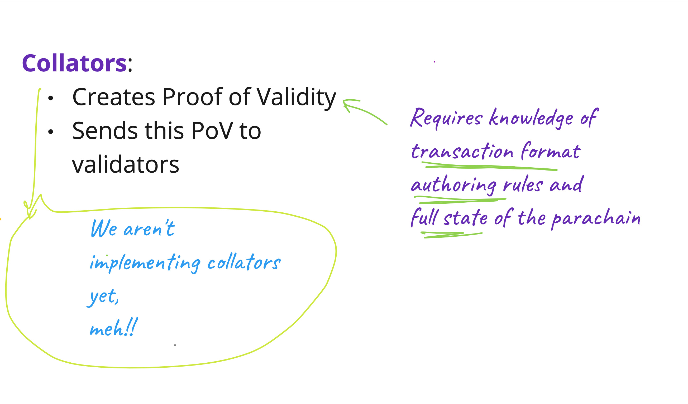
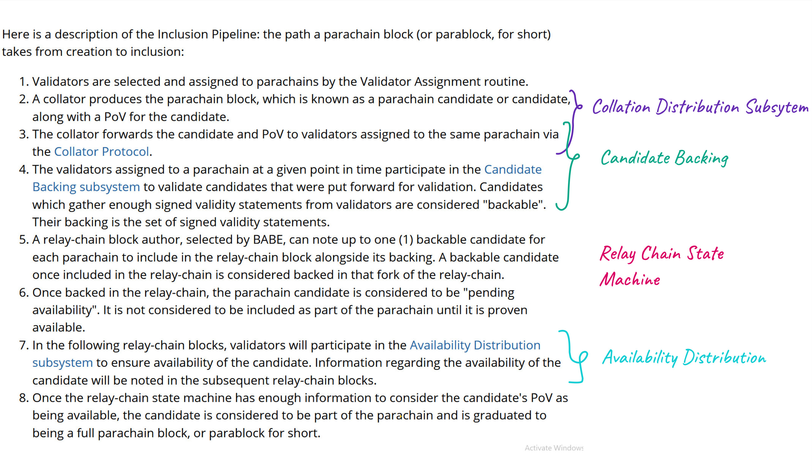
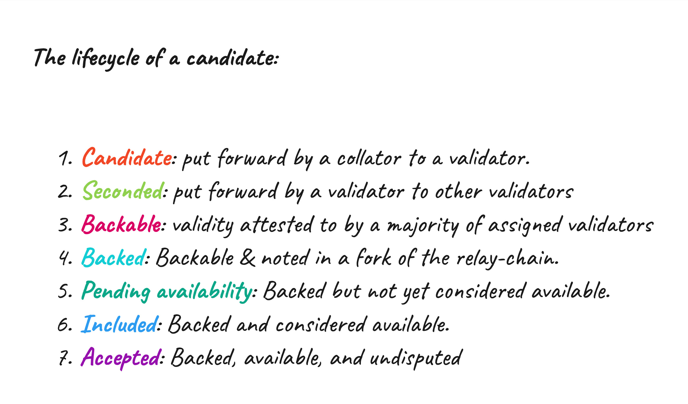
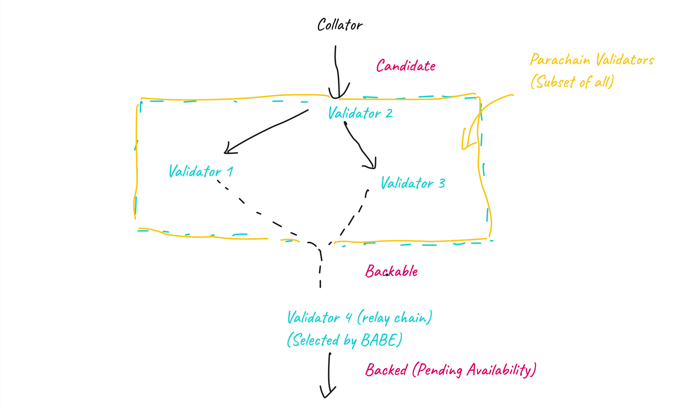
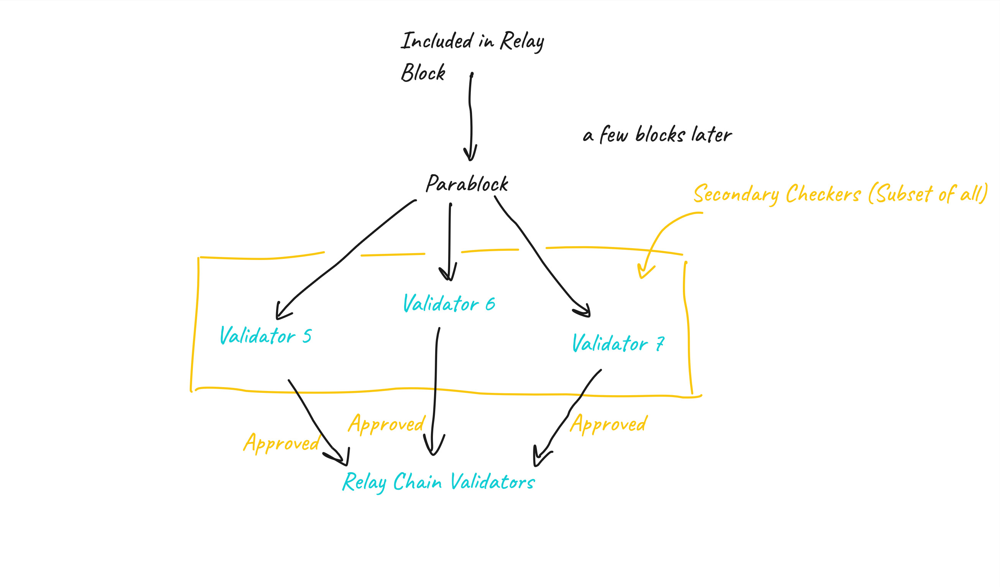
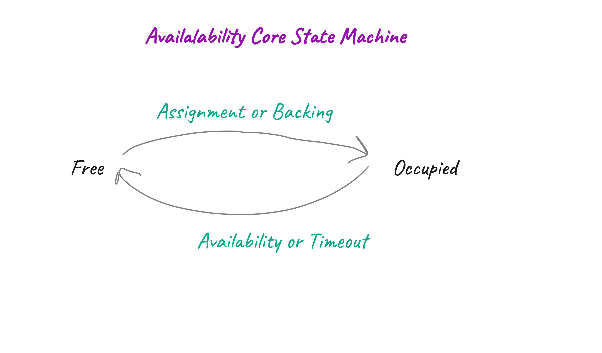
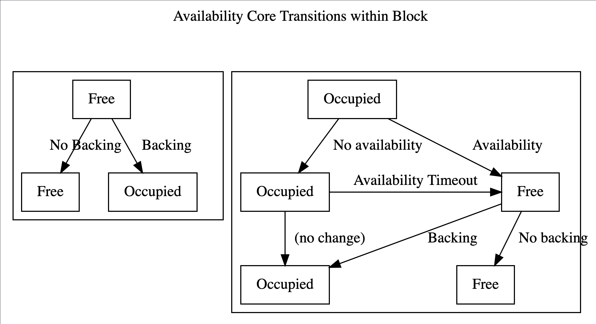

# Introduction

## Why do we even have Parachains?
- Scalability

PoS scales much better compared to PoW. Since we are not spending efforts in mining, block time and agreement could happen much faster.
However, consensus on a PoS chain requires full agreement of 2/3+ of the validator set for everything that occurs at Layer 1: all logic which is carried out as part of the blockchain's state machine. This means that everybody still needs to check everything. Furthermore, validators may have different views of the system based on the information that they receive over an asynchronous network, making agreement on the latest state more difficult.

Parachains are an example of a **sharded** protocol. Rather than requiring every participant to check every transaction, we require each participant to check some subset of transactions.

- Specialization

Being able to specialize on a problem gives the creator and users more leverage


## Why do we care? What are we trying to do?
The Primary purpose of polkadot is to provide security to parachains.
By providing security to parachains we mean
- validating
- authoring and
- finalizing
parachain blocks.

To do these task we need parachain protocol. It describes how relay chain nodes will talk to parachain nodes and include parachain blocks into relay chain.

## How do I know if a parachain block is authored?
Relay chain blocks have this information that we call `inherents`. For example we do store timeslot and babe slot as inherents in relay chain blocks.

One such inherent is `parachn0`, which is for parachain inherent data. It is through this parachain inherent data that we are going to tell which parachain blocks are authored.

https://github.com/ChainSafe/gossamer/blob/b1ecbf3c51ecd0dc0765300c13f4361334f1e04f/lib/babe/inherents/parachain_inherents.go#L452-L462

```go
// ParachainInherentData is parachains inherent-data passed into the runtime by a block author.
type ParachainInherentData struct {
	// Signed bitfields by validators about availability.
	Bitfields []uncheckedSignedAvailabilityBitfield `scale:"1"`
	// Backed candidates for inclusion in the block.
	BackedCandidates []backedCandidate `scale:"2"`
	// Sets of dispute votes for inclusion,
	Disputes multiDisputeStatementSet `scale:"3"`
	// The parent block header. Used for checking state proofs.
	ParentHeader types.Header `scale:"4"`
}
```

## What is Parachain Protocol
As a highly simplistic view, you can think of parachain protocol as a system that takes parachain blocks from parachain nodes and gives parachain inherents to be put in relay chain.


Where is Parachain Protocol running? Relay Chain Nodes.

So, how are these relay chain nodes running parachain protocol get parachain blocks from parachain nodes? Using some special nodes which are part of both the parachain and the relay chain. Let's call these special nodes :fire: **Collators** :fire:

**Collators** are at least light nodes in the relay chain and full node in the parachain.





## Inclusion Pipeline



Here is a description of the: the path a parachain block (or parablock, for short) takes from creation to inclusion:

- Validators are selected and assigned to parachains by the Validator Assignment routine.
- A collator produces the parachain block, which is known as a parachain candidate or candidate, along with a PoV for the candidate.
- The collator forwards the candidate and PoV to validators assigned to the same parachain via the Collator Protocol.
- The validators assigned to a parachain at a given point in time participate in the Candidate Backing subsystem to validate candidates that were put forward for validation. Candidates which gather enough signed validity statements from validators are considered "backable". Their backing is the set of signed validity statements.
- A relay-chain block author, selected by BABE, can note up to one (1) backable candidate for each parachain to include in the relay-chain block alongside its backing. A backable candidate once included in the relay-chain is considered backed in that fork of the relay-chain.
- Once backed in the relay-chain, the parachain candidate is considered to be "pending availability". It is not considered to be included as part of the parachain until it is proven available.
- In the following relay-chain blocks, validators will participate in the Availability Distribution subsystem to ensure availability of the candidate. Information regarding the availability of the candidate will be noted in the subsequent relay-chain blocks.
- Once the relay-chain state machine has enough information to consider the candidate's PoV as being available, the candidate is considered to be part of the parachain and is graduated to being a full parachain block, or parablock for short.

### Lifecycle of a candidate






## Approval Process

Once a parablock is considered available and part of the parachain, it is still "pending approval". 

### Why Approval

The validators in the parachain-group (known as the "Parachain Validators" for that parachain) are sampled from a validator set which contains some malicious members.
So, Parachain Validators for some parachain may be majority-dishonest, which means that (secondary) approval checks must be done on the block before it can be considered approved.

The Parachain Validators for a given parachain are sampled from an overall validator set which is assumed to be up to **<1/3 dishonest** - meaning that there is a chance to randomly sample Parachain Validators for a parachain that are majority or fully dishonest and can back a candidate wrongly.

A parablock's failure to pass the approval process will invalidate the block as well as all of its descendants. However, only the validators **who backed the block will be slashed**, not the validators who backed the descendants.

### Approval Process Pipeline

- Parablocks that have been included by the Inclusion Pipeline are pending approval for a time-window known as the secondary checking window.
- During the secondary-checking window, validators randomly self-select to perform secondary checks on the parablock.
- These validators, known in this context as secondary checkers, acquire the parablock and its PoV, and re-run the validation function.
- The secondary checkers gossip the result of their checks. Contradictory results lead to escalation, where all validators are required to check the block. The validators on the losing side of the dispute are slashed.
- At the end of the Approval Process, the parablock is either Approved or it is rejected.

Approval Process can be running for many parachain blocks at once.


### What is a Core?
### Collator Protocol

The Collator Protocol implements the network protocol by which collators and validators communicate. It is used by collators to distribute collations to validators and used by validators to accept collations by collators.

It serves as a bridge between a collator and a validator.

- Collators are only collating on a single parachain


### Approval Process

The Approval Process is the mechanism by which the relay-chain ensures that only valid parablocks are finalized and that backing validators are held accountable for managing to get bad blocks included into the relay chain.

We can deal with a bad parachain block as long as it doesn't get finalized.

https://paritytech.github.io/polkadot-sdk/book/runtime/scheduler.html

### Scheduler Pallet

The Scheduler module is responsible for two main tasks:
- Partitioning validators into groups and assigning groups to parachains.
- Scheduling parachains for each block

It aims to achieve these tasks with these goals in mind:

- It should be possible to know at least a block ahead-of-time, ideally more, which validators are going to be assigned to which parachains.
- Parachains that have a candidate pending availability in this fork of the chain should not be assigned.
- Validator assignments should not be gameable. Malicious cartels should not be able to manipulate the scheduler to assign themselves as desired.
- High or close to optimal throughput of parachains. Work among validator groups should be balanced.

### Availability Cores
The Scheduler manages resource allocation using the concept of "Availability Cores".

- There will be one availability core for each lease holding parachain, and a fixed number of cores used for multiplexing on-demand parachains. 
- Validators will be partitioned into groups, with the same number of groups as availability cores. 
- Validator groups will be assigned to different availability cores over time.

They could be in one of two states:
- Free 
can have a lease holding or on-demand parachain assigned to it for the potential to have a backed candidate included.
- Occupied
After backing, the core enters the occupied state as the backed candidate is pending availability. An occupied core becomes free again, ones the backed candidate becomes available.




**Validator groups** rotate across availability cores in a round-robin fashion, with rotation occurring at fixed intervals. 
The i'th group will be assigned to the (i+k)%n'th core at any point in time, where k is the number of rotations that have occurred in the session, and n is the number of cores. This makes upcoming rotations within the same session predictable.

## Availability Subsystems

The availability subsystems are responsible for ensuring that Proofs of Validity of backed candidates are widely available within the validator set, without requiring every node to retain a full copy.

They accomplish this by 
- broadly distributing erasure-coded chunks of the PoV, 
- keeping track of which validator has which chunk by means of signed bitfields. 

They are also responsible for reassembling a complete PoV when required, e.g. when an approval checker needs to validate a parachain block.